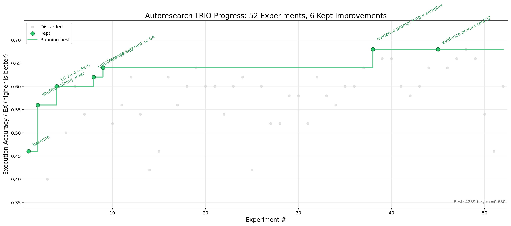

# autoresearch-trio



这是一个由 TRIO 驱动的自主 text-to-SQL 研究循环，设计上参考
[karpathy/autoresearch](https://github.com/karpathy/autoresearch)。

项目保留原版 autoresearch 的核心结构：

- `prepare.py` 是固定的数据和评估框架。
- `train.py` 是 agent 主要修改的实验文件。
- `train_async.py` 是可选的异步 TRIO runner，复用 `train.py` 的实验逻辑。
- `program.md` 是人写给 agent 的自主实验协议。
- SwanLab 用来记录云端实验曲线。
- `results.csv` 是本地实验记录的 source of truth。

## 任务

第一版 case 是 BIRD Text-to-SQL：

- train：`birdsql/bird23-train-filtered`
- 默认 eval：从 train 中按 `db_id` 整库隔离出的 50 条 holdout
- 可选 eval：`birdsql/bird_mini_dev` / `mini_dev_sqlite`
- database：本地 SQLite

## 数据目录

推荐自动下载：

```bash
uv run prepare.py --download
```

默认命令只准备 train 数据和 train 数据库，因为 eval 默认来自 train-holdout：

- 从 Hugging Face 下载 `birdsql/bird23-train-filtered` 到 `data/raw/bird23_train_filtered/train.jsonl`
- 下载并解压 BIRD train SQLite 数据库包到 `data/raw/bird23_train_filtered/train_databases/`

如果只想下载 JSON，不下载数据库：

```bash
uv run prepare.py --download-json-only --download-only
```

如果只想下载数据库包：

```bash
uv run prepare.py --download-databases --download-only
```

如果本地文件已存在但想重新下载：

```bash
uv run prepare.py --download --force-download
```

也可以手动把 BIRD 数据放到 `data/raw/`：

```text
data/raw/
  bird23_train_filtered/
    train.jsonl or train.json
    train_databases/
      {db_id}/{db_id}.sqlite
```

如果要改用官方 Mini-Dev 做 eval，需要额外准备：

```text
data/raw/
  bird_mini_dev/
    mini_dev_sqlite.jsonl or mini_dev_sqlite.json
    dev_databases/
      {db_id}/{db_id}.sqlite
```

`prepare.py` 会生成：

```text
data/processed/train.jsonl
data/processed/eval.jsonl
data/processed/manifest.json
```

## 快速开始

```bash
uv sync
uv run trio login
uv run swanlab login
uv run prepare.py --download
uv run train.py --dry-run --swanlab-mode disabled
uv run train.py > run.log 2>&1
cat results.csv
```

默认 `prepare.py` 会从 train 数据里按 `db_id` 整库隔离出 50 条 eval。这样不需要
Mini-Dev 数据库包，也不会把 holdout 数据库用于训练。

如果要改用官方 Mini-Dev，需要先手动或自动准备 Mini-Dev 数据库，然后运行：

```bash
uv run prepare.py --download --eval-source mini-dev
uv run train.py --eval-limit 500 > run.log 2>&1
```

如果不想自动下载，可以手动放好数据后运行：

```bash
uv run prepare.py --check
uv run prepare.py
```

如果数据缺失，`uv run prepare.py --check` 会打印期望的数据路径。

注意：Mini-Dev 数据库包来自 Google Drive。`prepare.py --eval-source mini-dev --download`
会尝试自动下载；如果 Google Drive 拦截自动下载，请按报错里的链接手动下载，然后解压整理到
`data/raw/bird_mini_dev/`。

## 密钥配置

正式训练前需要先配置两个 key：

- TRIO API Key：用于连接 TRIO 云端训练和推理服务。
- SwanLab API Key：用于把实验指标同步到 SwanLab 云端。

### 配置 TRIO

运行：

```bash
uv run trio login
```

命令行会提示你前往：

```text
https://pytrio.cn/dashboard
```

复制 API Key 后粘贴回终端。登录成功后，TRIO 会把凭证保存到：

```text
~/.pytrio/config.toml
```

之后 `train.py` 里的 `ServiceClient()` 会自动读取这个本地配置。

也可以直接传入 key：

```bash
uv run trio login -k <你的_TRIO_API_KEY>
```

重新登录：

```bash
uv run trio login --relogin
```

验证 TRIO 是否可用：

```bash
uv run python -c "import pytrio as trio; c=trio.ServiceClient(); print(c.get_supported_models())"
```

### 配置 SwanLab

运行：

```bash
uv run swanlab login
```

复制 SwanLab API Key 后粘贴到终端。也可以直接传入：

```bash
uv run swanlab login -k <你的_SWANLAB_API_KEY>
```

重新登录：

```bash
uv run swanlab login --relogin
```

SwanLab 也支持环境变量：

```bash
export SWANLAB_API_KEY="<你的_SWANLAB_API_KEY>"
```

注意：不要把 API Key 写进 repo 文件，也不要提交到 git。

## SwanLab

`train.py` 默认使用：

```text
project = autoresearch-trio
mode    = cloud
logdir  = swanlog
```

本地检查可以用：

```bash
uv run train.py --dry-run --swanlab-mode disabled
```

可选模式：

```bash
uv run train.py --swanlab-mode cloud
uv run train.py --swanlab-mode local
uv run train.py --swanlab-mode offline
uv run train.py --swanlab-mode disabled
```

## 异步训练

`train_async.py` 使用 TRIO 的 async API，把前后向、优化步骤和 eval 采样提交为异步任务。
它仍然复用 `train.py` 里的 prompt、超参、SFT mask 和结果记录逻辑，适合在同样的
`TIME_BUDGET=300` 下提高吞吐。

本地检查：

```bash
uv run train_async.py --dry-run --swanlab-mode disabled
```

正式运行：

```bash
uv run train_async.py \
  --run-tag apr-gpt5-5 \
  --description "async baseline" \
  --train-pipeline-depth 4 \
  --eval-concurrency 16 \
  > run.log 2>&1
```

`--train-pipeline-depth` 控制训练阶段最多同时等待多少个已提交步骤；
`--eval-concurrency` 控制 eval 采样并发数。数值太大可能让云端队列或本地日志变得难排查，
建议先用默认值。

## 实验循环

开始自主实验前先阅读 `program.md`。简要流程：

1. 创建 `autoresearch/<tag>` 分支。
2. 跑 baseline。
3. 之后主要只修改 `train.py`。
4. 每个实验想法都先 commit。
5. 运行：

   ```bash
   uv run train.py > run.log 2>&1
   ```

6. 如果指标提升，保留 commit；否则丢弃。

主指标优先级：

1. `ex`
2. `soft_f1`
3. `r_ves`
4. 更低的 `unsafe_sql_rate`
5. 更低的 `latency_ms`

## 测试

```bash
uv run python -m unittest
uv run train.py --dry-run --swanlab-mode disabled
```
